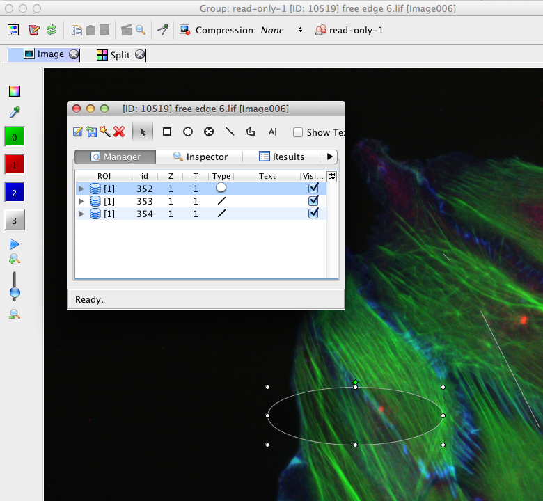

Delete ROI
==========

**To test in**: Insight

**Purpose of the test** is to test ROI deleting as well as ROI tools behaviour when the underlying image is being deleted

#. Add ROI to an image - use full viewer [:ref:`DeleteROI001`][:ref:`DeleteROI002`]

   - Delete a shape and save the ROIs.
   - Use the Red Cross Icon to delete all ROIs on the image

#. Import an image with ROI (find the image in [:download:`here <downloads/ImportTestingSetTable.pdf>`])

   - repeat step 1. with the imported ROIs

#. Add ROI to the image, go back to the DataManager and delete the image.

   - |C| that the Measurement Tool window disappears.

.. _DeleteROI001:
.. figure:: images/testing_scenarios/DeleteROI/001.png
   :align: center

   DeleteROI001: 

|
|
|
|
|
|
|
|
|
|
|
|
|
|
|
|
|
|
|
|
|
|
|
|
|
|
|
|

.. _DeleteROI002:

   DeleteROI002:

|
|
|
|
|
|
|
|
|
|
|
|
|
|
|
|
|
|
|
|
|
|
|
|
|
|
|
|
