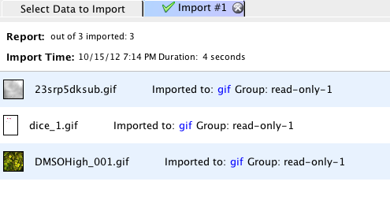
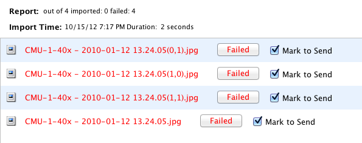
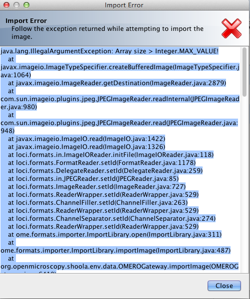
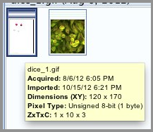
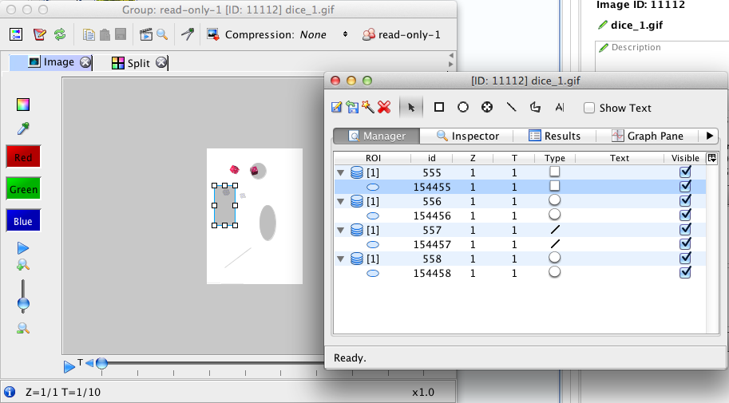

Import File Formats Testing
===========================

**To test in**: Insight

**Purpose of the test** is to check the import of various file formats and ability to report failures correctly.

#. Note any special cases for the file format. These will be in the Notes column in the spreadsheet - see [:download:`here <downloads/ImportTestingSetTable.pdf>`], or for special cases in a README which you must read first.

#. Import the files for this format. A known good selection is located in :file:`/ome/data_repo/test_images_good` or a larger set in :file:`/ome/data_repo/curated` (see details [:download:`here <downloads/ImportTestingSetTable.pdf>`]) 

   - Note that some formats have special import requirements--please check first!
   - |C| for any import failures, and take a copy of any exceptions
     (= import failure reasons in the "Failed" button window)
     or other failures [:ref:`ImportFileFT002`, :ref:`ImportFileFT003`, :ref:`ImportFileFT004`].
   - |C| that all files have been copied in any case, including import failure case.
   - |C| each imported image visually for the following features:
      - All images have thumbnails [:ref:`ImportFileFT005`]. Note that big images may take some time to generate thumbnails following import, showing clock placeholder [:ref:`ImportFileFT005b`].
      - All image planes are visible, and that the correct number of planes are in each dimension (check the metadata pane) [:ref:`ImportFileFT006`] and are of the correct size.
      - All ROIs (if any) are present and in the correct place [:ref:`ImportFileFT007`].

.. _ImportFileFT002:

   ImportFileFT002:

|
|
|
|
|
|
|
|
|
|
|
|
|
|
|
|
|
|
|
|
|
|
|
|
|
|
|
|

.. _ImportFileFT003:

   ImportFileFT003

|
|
|
|
|
|
|
|
|
|
|
|
|
|
|
|
|
|
|
|
|
|
|
|
|
|
|
|

.. _ImportFileFT004:

   ImportFileFT004

|
|
|
|
|
|
|
|
|
|
|
|
|
|
|
|
|
|
|
|
|
|
|
|
|
|
|
|

.. _ImportFileFT005:

   ImportFileFT005

|
|
|
|
|
|
|
|
|
|
|
|
|
|
|
|
|
|
|
|
|
|
|
|

.. _ImportFileFT005b:

   ImportFileFT005b

|
|
|
|
|
|
|
|
|
|
|
|
|
|
|
|
|
|
|

.. _ImportFileFT006:
.. figure:: images/testing_scenarios/ImportFileFormatsTesting/006.png
   :align: center

   ImportFileFT006: 

|
|
|
|
|
|
|
|
|
|
|
|
|
|
|
|
|
|
|
|
|
|
|
|
|
|
|
|

.. _ImportFileFT007:

   ImportFileFT007:

|
|
|
|
|
|
|
|
|
|
|
|
|
|
|
|
|
|
|
|
|
|
|
|
|
|
|
|

